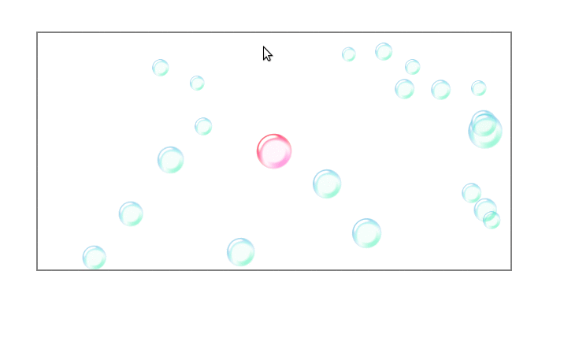

### 运行 

在项目文件下

```shell
> cd bubble/
```

运行本地服务器

```shell
> node server.js
```

在浏览器中打开`127.0.0.1：8000`


>如果运行失败，请将`static/`目录和index.html放在静态服务器上，
>
>浏览器中访问`http://.../bubble/index.html`
>
>

### 效果图



### 目录说明

- static/、index.html 为打包输出文件
- src/ 为源码
- server.js 为本地服务器


获取完整项目文件

```shell
> git clone git@github.com:chaosrc/bubble.git
```

或访问 [bubble](https://github.com/chaosrc/bubble)

